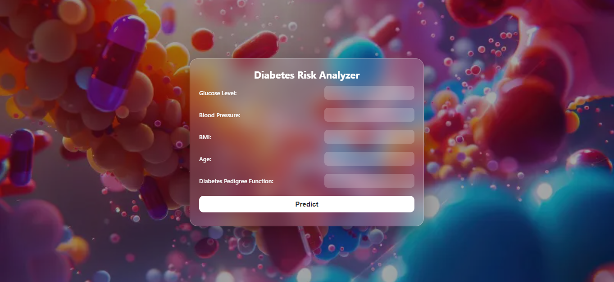
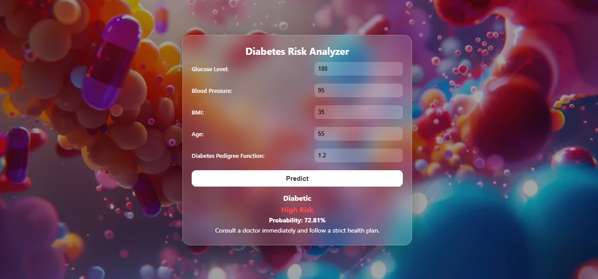

# 🩺 Diabetes Risk Analyzer

A Machine Learning-based web application that predicts the risk of diabetes using health parameters such as glucose level, blood pressure, BMI, age, and diabetes pedigree function. The model is trained using Random Forest and deployed using Flask on Render.

---

## 🚀 Live Demo

👉 https://diabetes-risk-analyzer-vkj3.onrender.com/

---

## 📸 Snapshots

### Home Page


### Prediction Result


---

## 📌 Features

- Predict diabetes risk instantly
- Shows result: Diabetic / Not Diabetic
- Displays risk level: Low / Medium / High
- Shows probability percentage
- Gives health suggestions
- Clean glassmorphism UI design
- Fully responsive web interface

---

## 🧠 Machine Learning Model

- Algorithm: Random Forest Classifier
- Library: Scikit-learn
- Handles missing values (0 replaced with median)
- Outputs probability-based prediction
- Trained on diabetes dataset

---

## 📂 Project Structure
```
Diabetes-Risk-Analyzer/
│
├── app.py
├── model.py
├── predict.py
├── requirements.txt
├── Procfile
│
├── model/
│   └── model.pkl
│
├── dataset/
│   └── diabetes.csv
│
├── static/
│   ├── style.css
│   ├── script.js
│   └── img/bg_9.webp
│
├── templates/
│   └── index.html
│
└── snapshots/
    ├── home-page.png
    └── prediction_result.png
```
---

## ⚙️ Installation & Setup

### 1. Clone Repository
```
git clone https://github.com/your-username/diabetes-risk-analyzer.git
cd diabetes-risk-analyzer
```
---

### 2. Install Dependencies
```
pip install -r requirements.txt
```
---

### 3. Train Model (First Time Only)
```
python model.py
```
---

### 4. Run Flask App
```
python app.py
```
Open in browser:
```
http://127.0.0.1:5000/
```
---

## 📊 Input Features

- Glucose: Blood glucose level
- BloodPressure: Blood pressure value
- BMI: Body Mass Index
- Age: Age of patient
- DiabetesPedigreeFunction: Genetic risk factor

---

## 🧪 Output

- Prediction: Diabetic / Not Diabetic
- Risk Level:
  - Low Risk 🟢
  - Medium Risk 🟡
  - High Risk 🔴

---

## ☁️ Deployment

- Platform: Render
- Backend: Flask
- Server: Gunicorn
- Model: joblib saved Random Forest model

---

## 🛠️ Tech Stack

- Python
- Flask
- Scikit-learn
- Pandas
- NumPy
- HTML, CSS, JavaScript
- Render

---

## 📈 Future Improvements

- Add more medical features
- Improve accuracy using XGBoost
- Add login system
- Store prediction history
- Mobile app version

---

## 👩‍💻 Author

Richa Melkani

---

## 📜 License

This project is for educational purposes only.
